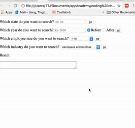

# Data Query
* tips: use `control + shift + M` to toggle Device Mode (pretty print)

# Description
The purpose of this project is to ingest the given JSON file, and return company names and number of companies based on different search queries. I initially had 3 ideas to implement this project:
1. Store JSON file locally. Use JavaScript to build queries and show results in HTML.
1. Use AJAX to request JSON file. Use Javascript to build queries and show results in HTML.
1. Store JSON file to SQL database. Use rails ActiveRecord to build queries in and show results in rails console.

The first option is not ideal when JSON file is large. It's also hard to share with other users when JSON file is stored locally. The third option will be more beneficial  when there are more relational data or when you have a full stack website. For this particular project, the second option seems most suitable. Please refer to below code for AJAX call

``` JavaScript
function requestUrl(){
  return new Promise(function(resolve, reject){
    let query = new XMLHttpRequest();
    let url = 'https://s3-us-west-2.amazonaws.com/bain-coding-challenge/data.json'
    query.onreadystatechange = function(e) {
      if (query.readyState === 4) {
        if (query.status === 200) {
          resolve(query.response)
        } else {
          reject(query.status)
        }
      }
    }
    query.ontimeout = function () {
      reject('timeout')
    }

    query.open('GET', url);
    query.send();
  })
}
```

# Instructions
1. Unzip the folder and open up `query.html`
1. To successfully use AJAX call, please follow steps below to avoid cross-origin restrictions and then refresh the page before you run the queries:
    1. Chrome: install [Allow-control-Allow-Origin extension](https://chrome.google.com/webstore/detail/allow-control-allow-origi/nlfbmbojpeacfghkpbjhddihlkkiljbi?hl=en) and then enable cross origin resource sharing
    1. Safari: Safari -> Preferences -> Advanced, and then at the bottom tick `Show Develop Menu in menu bar`. In the `Develop Menu` tick `Disable Cross-Origin Restrictions`

1. You are able to run queries against the provided JSON file, and the result will be shown in the result textarea and developer console. You can resize the textarea by dragging bottom right conner.
1. To change input JSON. Please head to `query.js` file and change url (line 123) to your desired url.



